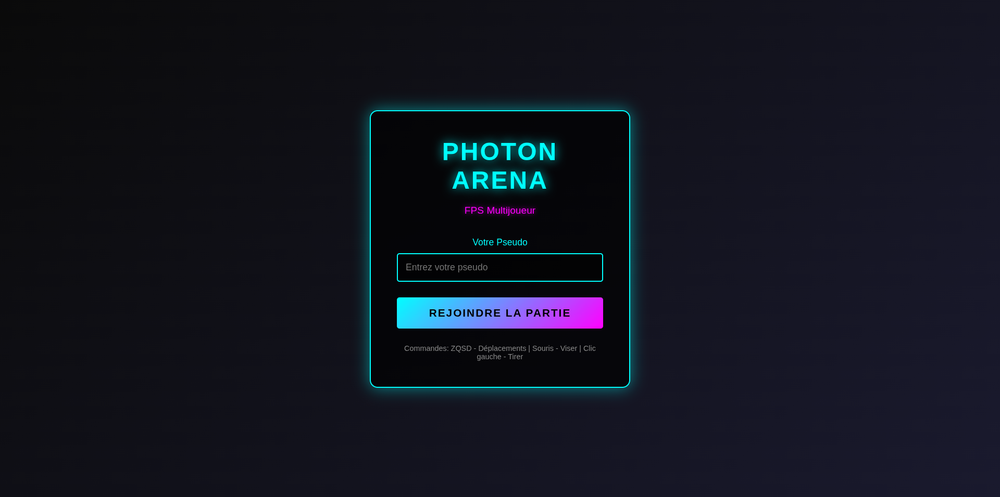
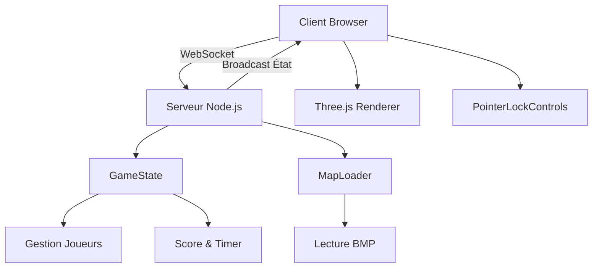

<div align="center">

# ⚡ PHOTON ARENA ⚡

### FPS Multijoueur Web - Laser Game Sans Installation

[](LICENSE)
[](https://nodejs.org/)
[](https://threejs.org/)

**Jouez directement dans votre navigateur - 2 à 8 joueurs - Connexion locale**

[🚀 Démarrage Rapide](#-installation-et-lancement) • [📖 Documentation](#-créer-des-maps-personnalisées) • [🎮 Gameplay](#-gameplay)

</div>

---

## 📸 Aperçu

<div align="center">

### Menu de Connexion


### Action en Jeu


</div>

## ✨ Caractéristiques

<table>
<tr>
<td width="50%">

### 🎯 Multijoueur Temps Réel
- 2 à 8 joueurs simultanés
- Synchronisation WebSocket
- Serveur autoritaire anti-triche
- Latence optimisée (30Hz tick rate)

</td>
<td width="50%">

### 🌐 Navigateur Uniquement
- Aucun téléchargement requis
- HTML5 + WebGL (Three.js)
- Compatible Chrome, Firefox, Edge
- Connexion directe via IP:PORT

</td>
</tr>
<tr>
<td>

### 🗺️ Maps Personnalisables
- Format BMP simple
- Codage couleur pixel
- Éditeur graphique compatible
- Génération 3D automatique

</td>
<td>

### ⚡ Performance & Style
- Objectif 60 FPS stable
- Graphismes low-poly néon
- Esthétique cyberpunk minimaliste
- Pas d'inscription nécessaire

</td>
</tr>
</table>

## 🎮 Gameplay

### 🕹️ Contrôles
```
WASD / ZQSD  →  Déplacements
Souris       →  Viser & Rotation caméra
Clic gauche  →  Tirer (laser hitscan)
Espace       →  Saut
```

### 🎯 Règles du Jeu
| Paramètre | Valeur |
|-----------|---------|
| **Points de vie** | 100 PV |
| **Dégâts par tir** | 25 (4 tirs = élimination) |
| **Score par kill** | +1 point |
| **Temps de respawn** | 3 secondes |
| **Durée de partie** | 5 minutes |
| **Victoire** | 20 éliminations OU meilleur score |

### 🏆 Conditions de Victoire
- 🥇 Premier à atteindre **20 éliminations**
- ⏱️ Ou meilleur score après **5 minutes**

---

## 🚀 Installation et Lancement

### 📋 Prérequis
- **Node.js** v14+ ([télécharger](https://nodejs.org/))
- Navigateur moderne (Chrome, Firefox, Edge)
- Python 3 + PIL/Pillow *(optionnel, pour créer des maps)*

### ⚡ Démarrage Rapide

**Option 1 : Scripts automatiques**
```bash
# Linux / Mac
./start.sh

# Windows
start.bat
```

**Option 2 : Manuel**
```bash
# Cloner ou télécharger le projet
cd "Photon Arena"

# Installer les dépendances
cd server
npm install

# Lancer le serveur
npm start
```

### 🌐 Rejoindre la Partie

<table>
<tr>
<td width="50%">

**💻 En Local**
1. Ouvrez `http://localhost:3000`
2. Entrez votre pseudo
3. Cliquez sur **REJOINDRE**
4. Cliquez sur **COMMENCER**

</td>
<td width="50%">

**🔗 Sur le Réseau**
1. Trouvez l'IP du serveur :
   - Windows : `ipconfig`
   - Linux/Mac : `ip addr` ou `hostname -I`
2. Ouvrez `http://[IP]:3000`
   *(ex: http://192.168.1.10:3000)*
3. Entrez votre pseudo et jouez !

</td>
</tr>
</table>

### 📺 Message de Démarrage du Serveur

```
╔═══════════════════════════════════════╗
║       PHOTON ARENA - SERVEUR          ║
╚═══════════════════════════════════════╝

Serveur démarré sur le port 3000

Pour rejoindre la partie :
- En local: http://localhost:3000
- Sur le réseau: http://[VOTRE_IP]:3000
```

---

## 🗺️ Créer des Maps Personnalisées

### 🎨 Codage Couleur BMP

Les maps sont des images BMP avec un système de codage couleur simple :

| Couleur | Code Hex | Fonction |
|---------|----------|----------|
| ⬜ **Blanc** | `#FFFFFF` | Sol traversable |
| ⬛ **Noir** | `#000000` | Mur (collision) |
| 🟪 **Fuchsia** | `#FF00FF` | Point de spawn |

### 🛠️ Créer une Map

**Méthode 1 : Éditeur d'image** 
     - Windows : `ipconfig`
     - Linux/Mac : `ip addr` ou `ifconfig`
   - Ouvrez `http://[IP_SERVEUR]:3000` (ex: `http://192.168.1.10:3000`)
3. Entrez votre **pseudo**
4. Cliquez sur **REJOINDRE LA PARTIE**
5. Cliquez sur **COMMENCER** pour verrouiller la souris et jouer !

## 🗺️ Créer des Maps Personnalisées

Les maps sont des **images BMP** de 64x64 pixels (ou plus) avec un codage couleur spécifique :

### Codage couleur

| Couleur | Code Hex | Fonction |
|---------|----------|----------|
| ⬜ Blanc | `#FFFFFF` | Sol (zone traversable) |
| ⬛ Noir | `#000000` | Mur (collision) |
| 🟪 Fuchsia | `#FF00FF` | Point de respawn |

**Méthode 1 : Éditeur d'image**
1. Créez une image **64x64 pixels** (ou 128x128)
2. Utilisez les couleurs **exactes** ci-dessus
3. Placez minimum **4 points de spawn** (fuchsia)
4. Sauvegardez en format **BMP**
5. Placez dans `/maps/default.bmp`

**Méthode 2 : Script Python**
```python
from PIL import Image

# Créer une map 64x64
width, height = 64, 64
img = Image.new('RGB', (width, height), color=(255, 255, 255))
pixels = img.load()

# Murs (bords)
for x in range(width):
    pixels[x, 0] = (0, 0, 0)
    pixels[x, height-1] = (0, 0, 0)
for y in range(height):
    pixels[0, y] = (0, 0, 0)
    pixels[width-1, y] = (0, 0, 0)

# Points de spawn
pixels[10, 10] = (255, 0, 255)
pixels[54, 10] = (255, 0, 255)
pixels[10, 54] = (255, 0, 255)
pixels[54, 54] = (255, 0, 255)

img.save('ma_map.bmp')
```

3. **Placez la map** :
   - Copiez votre fichier `.bmp` dans le dossier `/maps`
   - Renommez-le `default.bmp` (ou modifiez `server/server.js` ligne 16)
   - Redémarrez le serveur

## 📁 Structure du Projet

```
Photon Arena/
├── server/                 # Serveur Node.js
│   ├── server.js          # Point d'entrée WebSocket
│   ├── gameState.js       # Gestion de l'état du jeu
│   ├── mapLoader.js       # Chargement des maps BMP
│   └── package.json       # Dépendances
├── client/                # Client web
│   ├── index.html         # Page d'accueil (connexion)
│   ├── game.html          # Page de jeu
│   └── js/
│       ├── game.js        # Boucle principale
│       ├── player.js      # Contrôles FPS
│       ├── network.js     # WebSocket client
│       └── map.js         # Génération 3D de la map
├── maps/                  # Maps BMP
│   └── default.bmp        # Map par défaut
└── README.md
```

---

## 🔧 Architecture Technique

<div align="center">



</div>

### 🖥️ Serveur (Node.js)
| Composant | Technologie | Rôle |
|-----------|-------------|------|
| **Communication** | WebSocket (ws) | Temps réel bidirectionnel |
| **Serveur Web** | Express | Fichiers statiques + API |
| **Game Loop** | setInterval 30Hz | Tick rate optimisé |
| **Maps** | Jimp | Lecture BMP pixel par pixel |
| **Validation** | Autoritaire | Anti-triche, dégâts, score |

### 🌐 Client (Three.js + WebGL)
| Composant | Technologie | Rôle |
|-----------|-------------|------|
| **Rendu 3D** | Three.js | WebGL renderer |
| **Contrôles** | PointerLockControls | Caméra FPS |
| **Réseau** | WebSocket API | Synchronisation temps réel |
| **Raycasting** | Three.js Raycaster | Détection tirs |
| **Physics** | Custom | Gravité, collisions |

### 🔄 Flux de Données
```
Client ──► [Inputs: WASD, Souris, Tir] ──► Serveur
           ◄── [État: Positions, Scores, HP] ◄──
```

---

## 🐛 Dépannage

<details>
<summary><b>❌ Le serveur ne démarre pas</b></summary>

- Vérifiez Node.js : `node --version` (v14+ requis)
- Port 3000 déjà utilisé ? Changez dans `server/server.js`
- Réinstallez : `cd server && rm -rf node_modules && npm install`

</details>

<details>
<summary><b>🔌 Impossible de se connecter</b></summary>
<details>
<summary><b>🔌 Impossible de se connecter</b></summary>

- Serveur démarré ? Vérifiez le terminal
- URL correcte ? `http://` et non `https://`
- Pare-feu ? Autorisez le port 3000
- Réseau local ? Utilisez l'IP privée (192.168.x.x)
- Testez : `http://localhost:3000`

</details>

<details>
<summary><b>🗺️ La map ne se charge pas</b></summary>

- Fichier existe ? Vérifiez `/maps/default.bmp`
- Couleurs exactes ? `#FFFFFF`, `#000000`, `#FF00FF`
- Points de spawn ? Minimum 1 pixel fuchsia requis
- Format BMP ? Pas PNG, JPG ou autre

</details>

<details>
<summary><b>⚡ Lag ou saccades</b></summary>

- Limitez les murs : max ~300 pour une map 64x64
- Réduisez la taille de la map
- Fermez les applications gourmandes
- Vérifiez la latence réseau (ping)

</details>

---

## 🚀 Roadmap & Améliorations Futures

<table>
<tr>
<td width="50%">

### 🎮 Gameplay
- [ ] Plusieurs types d'armes
- [ ] Power-ups sur la map
- [ ] Modes de jeu variés
  - [ ] Team Deathmatch
  - [ ] Capture the Flag
  - [ ] Zone Control

</td>
<td width="50%">

### ✨ Fonctionnalités
- [ ] Système de rooms multiples
- [ ] Sons et effets sonores
- [ ] Minimap 2D
- [ ] Statistiques détaillées
- [ ] Replay de partie
- [ ] Support mobile tactile

</td>
</tr>
</table>

---

## 📜 Licence

**MIT License** - Utilisez, modifiez et distribuez librement !

## 🤝 Contribution

Les contributions sont les bienvenues ! 🎉

<table>
<tr>
<td>

### 🐛 Signaler un Bug
Ouvrez une [issue](../../issues) avec :
- Description du problème
- Étapes pour reproduire
- Navigateur / OS utilisé

</td>
<td>

### ✨ Proposer une Fonctionnalité
Créez une [discussion](../../discussions) pour :
- Nouvelles idées de gameplay
- Améliorations techniques
- Suggestions d'UI/UX

</td>
</tr>
<tr>
<td>

### 🗺️ Partager des Maps
Publiez vos créations :
- Maps BMP originales
- Screenshots en jeu
- Tutoriels de création

</td>
<td>

### 💻 Contribuer au Code
Pull Requests bienvenues :
- Fork le projet
- Créez une branche feature
- Testez vos changements
- Soumettez votre PR

</td>
</tr>
</table>

---

<div align="center">

### ⚡ **Bon jeu dans Photon Arena !** 🎮

**Créé avec ❤️ par des passionnés de FPS multijoueur**

[](https://github.com/Davidlouiz/Photon-Arena)
[](https://github.com/Davidlouiz/Photon-Arena/fork)

[⭐ Star ce projet](https://github.com/Davidlouiz/Photon-Arena) • [🐛 Reporter un bug](../../issues) • [💡 Suggestions](../../discussions)

</div>
